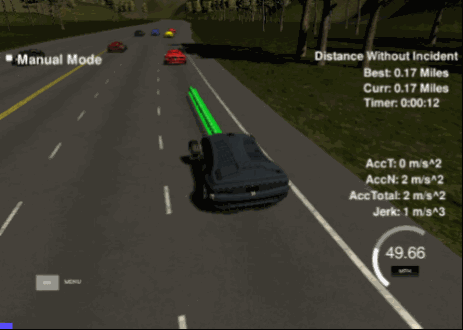

# Path-Planning-Project (Highway driving)
This project is part of my "Self-Driving Car Engineer"-Nanodegree Program at Udacity.com


## Goal
The goal of this project is to safely navigate a car on a virtual highway with different cars.

To build the behavior planner the required car localization and sensor-fusion-data is provided by the simulator. The car should try to changes lanes to pass slower cars or stay in lane and follow the car ahead respective to a secure distance when there is no option to pass safely.



All acceptance-criteria:
- The car passes cars if possible
- The maximum total acceleration 10 m/s^2
- The maximum jerk is 10 m/s^3
- Lane changes do not take longer than 3 seconds
- Car stays in lane (unless going to another lane)
- The car drives according to the speed limit.
- The car is able to drive at least 4.32 miles without incident..
- Car does not have collisions.
- The car stays in its lane, except for the time between changing lanes.


### Simulator.
You can [download the Simulator](https://github.com/udacity/self-driving-car-sim/releases/tag/T3_v1.2) which contains the Path Planning Project.

To run the simulator on mac/linux, first make the binary file executable with the following command:
``` bash
sudo chmod u+x {simulator_file_name}
```


## The map of the highway is in data/highway_map.txt
Provided by udacity:
Each waypoint in the list contains  [x,y,s,dx,dy] values. x and y are the waypoint's map coordinate position, the s value is the distance along the road to get to that waypoint in meters, the dx and dy values define the unit normal vector pointing outward of the highway loop.

The highway's waypoints loop around so the frenet s value, distance along the road, goes from 0 to 6945.554.


## Basic Build Instructions

``` bash
# Clone
git clone https://github.com/KevinHubert-Dev/Highway-Drive.git.
cd Highway-Drive

# Install dependencies
./install-ubuntu.sh

# Build
mkdir build
cd build
cmake .. && make

# Start
./path_planning
```


## Dependencies

* cmake >= 3.5
  * All OSes: [click here for installation instructions](https://cmake.org/install/)
* make >= 4.1
  * Linux: make is installed by default on most Linux distros
  * Mac: [install Xcode command line tools to get make](https://developer.apple.com/xcode/features/)
  * Windows: [Click here for installation instructions](http://gnuwin32.sourceforge.net/packages/make.htm)
* gcc/g++ >= 5.4
  * Linux: gcc / g++ is installed by default on most Linux distros
  * Mac: same deal as make - [install Xcode command line tools]((https://developer.apple.com/xcode/features/)
  * Windows: recommend using [MinGW](http://www.mingw.org/)
* [uWebSockets](https://github.com/uWebSockets/uWebSockets)
  * Run either `install-mac.sh` or `install-ubuntu.sh`.
  * If you install from source, checkout to commit `e94b6e1`, i.e.
    ```
    git clone https://github.com/uWebSockets/uWebSockets 
    cd uWebSockets
    git checkout e94b6e1
    ```


## Code Style

The code style is inspired by [Google's C++ style guide](https://google.github.io/styleguide/cppguide.html).


## Behavior planning model
The base-implementation of the project to follow the lanes and ensure a smooth curvatur is inspired by the udacity-tutorial and uses [spline-interpolation](https://kluge.in-chemnitz.de/opensource/spline/). A introducing to the base-architecture can be found in the [Q/A video for this project](https://www.youtube.com/watch?v=7sI3VHFPP0w).

After implementing the basic architecture i've decided to implemented two variants of solutions with differents approaches reactive and predictive. 
In my main.cpp you can find the "reactive"-approach which is also the variant i used for the submission.
The "predictive"-approach handled some situations better but still has little adjustments/fixes to do.


### Reactive

The reactive approach is mostly inspired by the Q/A video. In general it uses the following logic:
As long as there is no car X meters in front of me on the same lane just keep driving. When a car is less than X meter in front of me on the same lane, check if there is a lane on the left- or right-side of me and if there is enough space to do a lane-change into this specific lane (no car driving in the lane Y meters in front or behind relative to my current position). Is there a lane without a car in the near distance: do a lane-change to the specific lane. If there is no option to do a lane-change, stay in the current lane and adjust the velocity of my car to be a little bit lower than the not passable car directly in front of us, to avoid a collision.
To ensure that there is no collision during a lane-change within a relativly slow/fast car, the Y-value (which checks if there is a car infront-/behind me on the other lane) is quite big chosen.

Advantages:
- Drives quite save
- Relativly easy to implement
- Low amount of parameters to adjust

Disadvantages:
- Does not evaluate the best option for a lane-change
- The big choosen Y-value sometimes blocks options to pass a car on another lane, because it waits for a too big gap on the other lanes.

For sure the whole code is well commented. For completion i've added some code-snippets and description below:

The following code-snippets are from "./src/main.cpp"

Go from map- to local-coordinates (inspired by Udacity) 
```cpp
// Calculate the coordinates from world to car-positions. 
// As described in the Udacity Q|A video "Makes the math much more easier"
for(int i = 0; i < ptsx.size(); i++) {
  // Store the shift in coordinates for x, y
	double shift_x = ptsx[i] - ref_x;
	double shift_y = ptsy[i] - ref_y;
  
  // Take in account the current yaw-rate for position-transformation to local coordinates
  ptsx[i] = shift_x * cos(0 - ref_yaw) - shift_y * sin(0 - ref_yaw);
  ptsy[i] = shift_x * sin(0 - ref_yaw) + shift_y * cos(0 - ref_yaw);
}
```

Check if the given set of values from sensor-fusion-data should trigger a lane-change.
This snippet is called for all available sensor-fusion-data separatly
```cpp
// If car is on same lane as my car
if (d_to_lane(car_d) == d_to_lane(d)) {
  
  // If the car is in front of us and closer than 30s (s from frenet 
  // coordinate: https://www.classe.cornell.edu/~hoff/LECTURES/10USPAS/notes04.pdf)
  if ((check_car_s > car_curr_s) && (check_car_s - car_curr_s < 30)) {
    
    // We should try a lane-change
    too_close = true;
    
    // Save speed if the car is the slowest. This will be used for velocity adjustment
    if (check_speed < car_ahead_velocity) {
    car_ahead_velocity = check_speed;
    }
    // Check if it is closer than a car scanned before
    if (check_car_s - car_curr_s < car_ahead_s_delta) {
    	car_ahead_s_delta = check_car_s - car_curr_s;
    }
  }             
}
```

Check which lane is free to change to.
Also this is called for each sensor-fusion-set.
```cpp
// Avoid collisions
// Check if the lane would be safe to go. Therefore there has to be no car 30-s ahead or behind me based on my current position.
if ((check_car_s > car_curr_s - 30) && (check_car_s < car_s + 30)) {
	// If a car is found in the range -/+ 30-s of me, mark that lane as unsafe.
  	switch(d_to_lane(d)) {
      case 0: left_lane_save = false; break;
      case 1: middle_lane_save = false; break;
      case 2: right_lane_save = false; break;
    }
}
```

Check if a alternative lane is available
```cpp
bool switch_lane_possible = false;
int plannedLane = -1;

// When there is a car closly ahead to us
if (too_close) {
  // If we are on the middle lane       
  if (d_to_lane(car_d) == 1) {
      if (left_lane_save) {
        // Left-lane has enough space. Go there
        plannedLane = 0;
        switch_lane_possible = true;
      } else if (right_lane_save) {
        // Right lane has enough space. Go there
        plannedLane = 2;
        switch_lane_possible = true;
      }
  // If we are on the left-/right-lane, check for the middle lane
  } else if (d_to_lane(car_d) == 0 || d_to_lane(car_d) == 2) {
      if (middle_lane_save) {
        // Left-lane has enough space. Go there
        plannedLane = 1;
        switch_lane_possible = true;
      }
  } 
}
```

Additional behavior-planning in the part of the code were the next-waypoints are calculated.
If ensured that this the acceleration/deceleration is adjusted in the waypoint-planning-block to ensure a better acceleration/deceleration for each waypoint, the suggested solution from the  Q|A video
had the problem, that it only accelerated/decelerated for the next X waypoints grouped instead of for each step separatly, this leads to a bigger required distance to archieve the desired velocity.
```cpp
if (!too_close) {
  if (car_ahead_s_delta >= 10) {
    // If the car is far enough away and we drive slower than allowed -> accelerate
    if (ref_vel <= max_vel) {
      ref_vel += max_acceleration;
    }
  } else {
    // Adjust speed to the car driving ahead if it is still faster than us.
    if (ref_vel < (car_ahead_velocity * 2.24)) {
	    ref_vel += max_acceleration;
    }
  }
} else {
  // If there is a car very close ahead of us
  // Adjust speed if a lane-change was not possible
  if (!switch_lane_possible) {
    // If the car is slower than us (* 2.24 is required because we drive in mph and the measurement of the car ahead is in mps)
    if (ref_vel > (car_ahead_velocity * 2.24)) {
      // Reduce speed relativly to the distance to the car ahead. The closer we get, the more we decelerate
      ref_vel -= max_deceleration / pow((car_ahead_s_delta - 5), 0.1); // Decrease velocity based on distance
    }
  }
}
```

### Predictive

Summary of the following section (TL;DR;)
In this section you can read about another approach i've developed during this project. The approach is just for testing purpose and currently not part of the main.cpp-code i've used for the project submission. This approach uses sensor-fusion values which are further away to decide which specific lane is the best choice instead of change to a random free lane if it is free to go.


The predictive part can be found in the "main_predictive.cpp"-file in the "src"-folder.
Based on the reactive solution i've created a copy which uses a more predicitive approach and even uses more complexe cost-functions for lane-changes.
The base of the algorithm is the same as described above (see: Reactive). Moreover this solution has a "best_lane" evaluation which scans each car ahead with a distance of lower than Z meters, if there is a car in this range, a "costs"-value is added for the lane the car is driving in. Because the Z-value is choosen to be larger than the trigger which leads to a lane-change, the calculated cost for each lane also contains information which lane may could be the best based on others cars way ahead of our current location. This is especially intersting if i currently drive on the middle-lane and can choose between changing to the left or right lane. Based on the calculated cost i can predict which of the two options would be better for the near future.

To avoid unnecessary lane-changes this solution only does a lane-chane, when a car is X-meters in front of our current location (same as in the reactive-approach). 

Doing my testing i got pretty good results as my car adjust the speed when it is getting closer to a car ahead and there is no option to switch lane. Due to the fact, that there randomly appeared car which switched lane very close infront of me, i've also added a special handling for very close cars directly in front of me.

I look forward to improve this approach after doing the nanodegree and may find a even better solution.

Advantages:
- Choose the best-lane if there are more than 1 option to choose from
- Calculates the best lane even if it is more than 1-lane-change away

Disadvantages:
- Lot of parameters to adjust
- Way more complexe to program and more error-prone

For my submission i've decided to submit the 'Reactive'-approach of the algorithm, because it is still fast enough and drives more-safely under exceptional circumstances.

The code snippes below are part of the "./src/main_predictive.cpp"

Example of the cost-function for each lane:
This function does not only scans how far away the next car is on the specific lane but also if there are multiple cars on the same lane because this increases the risk for a slower car (based of experience from the simulator)
Moreover the closer the car, the higher the cost (see: pow(..., 1.2))
```cpp
// Calculcate the cost for each lane, the costs bases on distance to car and amount of cars.
if ((check_car_s > car_curr_s) && (check_car_s - car_curr_s) < planning_distance) {
  switch(d_to_lane(d)) {
    case 0: left_lane_cost   += pow(planning_distance - (check_car_s - car_s), 1.2); break;
    case 1: middle_lane_cost += pow(planning_distance - (check_car_s - car_s), 1.2); break;
    case 2: right_lane_cost  += pow(planning_distance - (check_car_s - car_s), 1.2); break;
  }
}
```

Additional here is the current formula which calculate the required gap on another lane to indicate a lane-change would be save. As described in the code, this formula evaluate a lane-change to be safer when my velocity is closer to the maximum velocity. The idea behind the formula is: if i nearly drive the maximum velocity, the delta between my velocity and a driving car on the other lane is less as when i need to do e.g. a cold-start, so the required space is smaller too (this avoids rear-end collision from other cars into mine).
```cpp
double dynamic_safty_distance = ((fabs(ref_vel - max_vel) / max_vel) * lane_change_safty_range) + 15;
```

# About

Made with 💗 & 💻 by Kevin H.

More about me can be found here
- :octocat: [GitHub](https://github.com/KevinHubert-Dev) 
- 🏠 [Homepage](http://Kevin-Hubert.de/)
